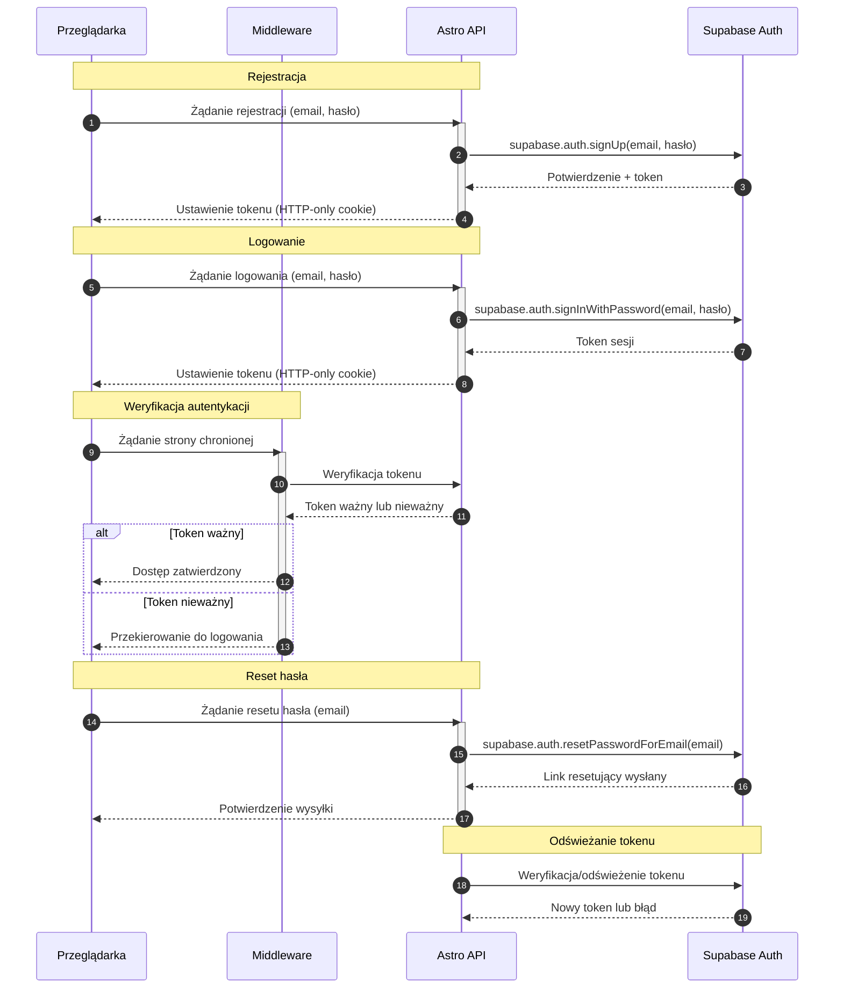

<authentication_analysis>
Proces autentykacji obejmuje następujące przepływy:

1. Rejestracja – użytkownik wypełnia formularz rejestracji (email, hasło) i wysyła żądanie do Astro API, które wywołuje metodę supabase.auth.signUp. Po sukcesie zwracany jest token sesji, ustawiany w HTTP-only cookie.
2. Logowanie – użytkownik loguje się poprzez formularz logowania; Astro API wywołuje supabase.auth.signInWithPassword i otrzymuje token sesji, który jest zapisywany w ciasteczce.
3. Reset hasła – użytkownik inicjuje reset hasła, wysyłając email poprzez formularz; Astro API wywołuje supabase.auth.resetPasswordForEmail, a użytkownik otrzymuje link resetujący.
4. Middleware – przy każdym żądaniu do stron chronionych, middleware weryfikuje ważność tokenu. W przypadku nieważnego tokenu następuje przekierowanie na stronę logowania.
5. Odświeżanie tokenu – w przypadku wygaśnięcia tokenu, system podejmuje próbę jego odświeżenia; nieudana próba skutkuje wylogowaniem użytkownika.
   </authentication_analysis>

<mermaid_diagram>

</mermaid_diagram>
