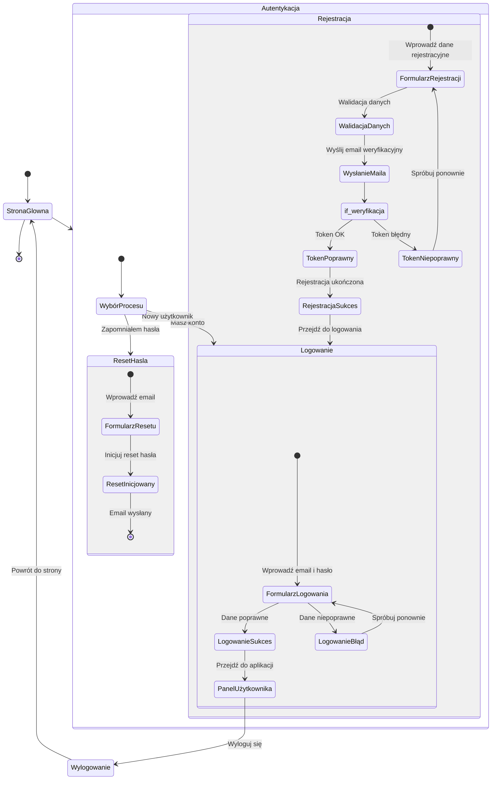

# Analiza podróży użytkownika

Poniższy dokument przedstawia kompleksową analizę podróży użytkownika w module autentykacji oraz korzystania z aplikacji 10xCards. Zawiera opis poszczególnych etapów procesu, od wejścia na stronę, poprzez rejestrację, logowanie, resetowanie hasła, aż po dostęp do głównej funkcjonalności aplikacji. Diagram łączy podejście przedstawione w dokumentach @ui.md oraz @auth.md.

## Analiza modułu podróży użytkownika

1. Użytkownik otwiera aplikację. Jeżeli nie jest zalogowany, zostaje przekierowany do strony logowania.
2. W przypadku rejestracji:
   - Użytkownik wypełnia formularz rejestracji, podając email, hasło oraz potwierdzenie hasła.
   - Następuje walidacja danych oraz wysyłka emaila z linkiem weryfikacyjnym.
   - Punkt decyzyjny (if_weryfikacja) sprawdza poprawność tokena. W przypadku błędnego tokena użytkownik musi spróbować ponownie.
   - Po poprawnej weryfikacji użytkownik jest zachęcany do logowania.
3. W przypadku logowania:
   - Użytkownik wpisuje dane logowania w formularzu.
   - Po weryfikacji danych następuje przekierowanie do panelu użytkownika, gdzie dostępna jest główna funkcjonalność aplikacji.
4. W przypadku resetu hasła:
   - Użytkownik podaje adres email w celu inicjacji procedury resetu hasła.
   - System wysyła instrukcje resetujące na podany adres email.
5. Proces wylogowania kończy sesję i przekierowuje użytkownika na stronę główną (stronę logowania).

## Diagram podróży użytkownika

