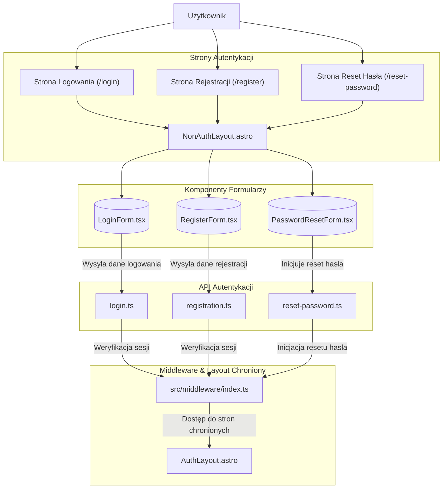

<architecture_analysis>
Analiza modułu autentykacji:

1. Komponenty:
   - RegisterForm.tsx: Formularz rejestracji, odpowiedzialny za walidację danych i przesyłanie informacji do endpointu rejestracji.
   - LoginForm.tsx: Formularz logowania, walidujący dane i wysyłający żądanie logowania do API.
   - PasswordResetForm.tsx: Formularz resetowania hasła, inicjujący proces wysyłki maila resetującego.
2. Strony:
   - /register, /login, /reset-password: Dedykowane strony korzystające z NonAuthLayout.astro, zapewniające spójny interfejs.
   - AuthLayout.astro: Layout dla stron dostępnych dla zalogowanych użytkowników (z TopMenu i zabezpieczeniem).
3. API:
   - registration.ts, login.ts, reset-password.ts w katalogu /api/auth: Endpointy obsługujące rejestrację, logowanie i reset hasła, integrujące się z Supabase Auth.
4. Middleware:
   - src/middleware/index.ts: Chroni strony wymagające autentykacji poprzez weryfikację sesji/tokenu.
5. Przepływ danych:
   - Użytkownik wchodzi na stronę (np. /login), która korzysta z NonAuthLayout do renderowania odpowiedniego formularza (LoginForm).
   - Formularz wysyła dane do odpowiedniego API (login.ts), gdzie następuje weryfikacja.
   - Middleware sprawdza autentyczność i w razie sukcesu przekierowuje do chronionych zasobów (AuthLayout).
     </architecture_analysis>

<mermaid_diagram>

</mermaid_diagram>
